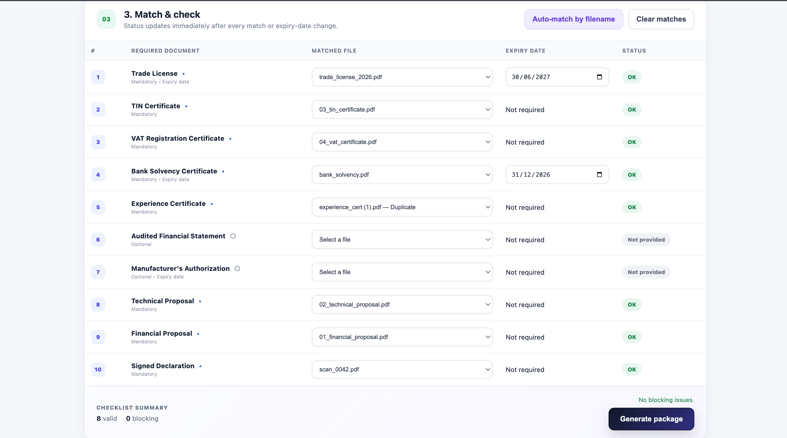

# Tender Package Builder

A frontend-only web application for preparing, validating, and generating complete tender submission packages from PDF documents.

## 🚀 Live Demo

https://ai-dev-fest-2026-kazi-aurpon-4edoxhvpx-aurpon.vercel.app

## 💻 GitHub Repository

https://github.com/kaziaurpon/AI-Dev-Fest-2026-Kazi_Aurpon

---

## 📌 Project Overview

Tender Package Builder helps bidders organize required tender documents, validate their submission status, detect duplicate documents, manage expiry dates, and generate a final combined PDF package.

The application runs entirely in the browser and does not require a backend, database, or user login.

It supports both **English and Bangla**, making the workflow easier for users working with bilingual tender requirements.

---

## ✨ Key Features

### Tender Requirements
- Loads tender requirements from `requirements.json`
- Displays tender ID, title, procuring entity, bidder name, and submission deadline
- Displays required documents according to their defined order
- Supports English and Bangla document titles

### PDF Document Management
- Upload multiple PDF documents
- Displays uploaded filename, page count, and file information
- Clearly rejects non-PDF files
- Allows users to remove uploaded documents
- Safely handles invalid or unsupported PDF files

### Document Matching
- Matches uploaded PDF files with required tender documents
- Maintains one-to-one matching between files and required documents
- Allows users to change or undo document matching
- Prevents the same document from being assigned to multiple requirements

### Expiry Date Validation
- Supports expiry dates for documents where required
- Requests an expiry date when `has_expiry` is enabled
- Compares document expiry dates with the tender submission deadline
- Treats documents expiring on the submission deadline as valid

### Duplicate Detection
- Detects exact-content duplicate PDF files
- Uses file content rather than filename for duplicate detection
- Prevents duplicate content from being matched to different required documents

### Document Status
Each required document receives exactly one status:

- **Missing** — Required document has not been provided
- **Expiry Date Needed** — Required expiry date has not been entered
- **Expired** — Document expires before the submission deadline
- **Not Provided** — Optional document has not been provided
- **OK** — Document satisfies all requirements

Blocking statuses are clearly identified and prevent package generation.


```md
## 📦 Submission Artifacts

The repository contains the required final submission artifacts.

### Final Generated Package

[📄 Open / Download Final Tender Package](output/T-2026-0417_Package.pdf)

This is the final combined tender package generated from the provided sample documents.

### Document Status Screenshot



This screenshot demonstrates the document status interface of the application.

### 🌐 Language Support
The complete application interface supports:

- English
- বাংলা (Bangla)

Document names are displayed using the appropriate `title_en` or `title_bn` value.

---

## 🛠️ Technology Stack

- React
- Vite
- JavaScript
- HTML5
- CSS3
- Browser-based PDF processing
- SHA-256 content hashing for duplicate detection

No backend or external database is required.

---

## 📂 Project Structure

```text
AI-Dev-Fest-2026-Kazi_Aurpon/
│
├── public/
│
├── src/
│   ├── main.jsx
│   └── styles.css
│
├── output/
│   └── T-2026-0417_Package.pdf
│
├── screenshots/
│   └── statuses.png
│
├── index.html
├── package.json
├── package-lock.json
├── vite.config.js
├── README.md
├── LICENSE
└── .gitignore